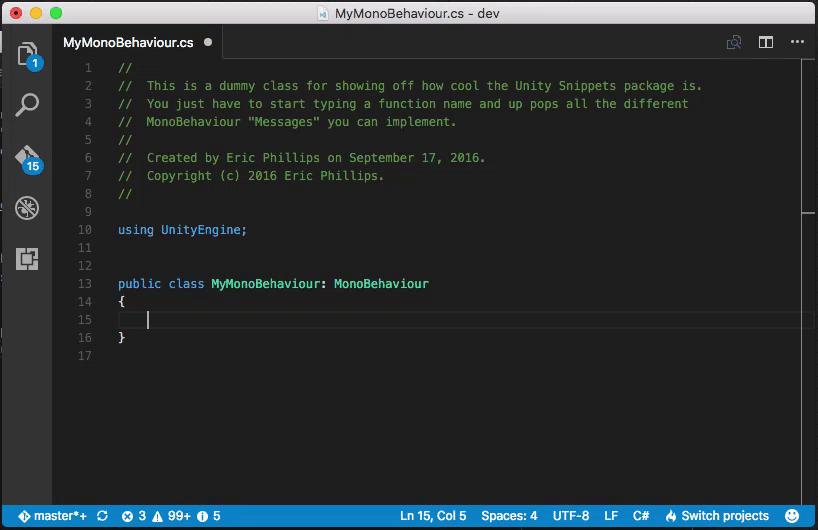

# VS Code Unity Snippets
This extension for Visual Studio Code provides code snippets for working with Unity
C# scripts. It contains the "Message" functions within MonoBehaviour, such as "Start",
"OnCollisionEnter", and "OnSerializeNetworkView", complete with their signatures and
brief documentation.

## Usage
To use the snippets, simply begin typing one of the functions and the suggestions will
appear within the IntelliSense popup. Press enter or tab to insert the snippet.

## Installation
1. Open the VS Code command palette `Ctrl`-`Shift`-`P` (Windows, Linux) or `Cmd`-`Shift`-`P` (OSX).
2. Type `ext install unity-snippets`.
